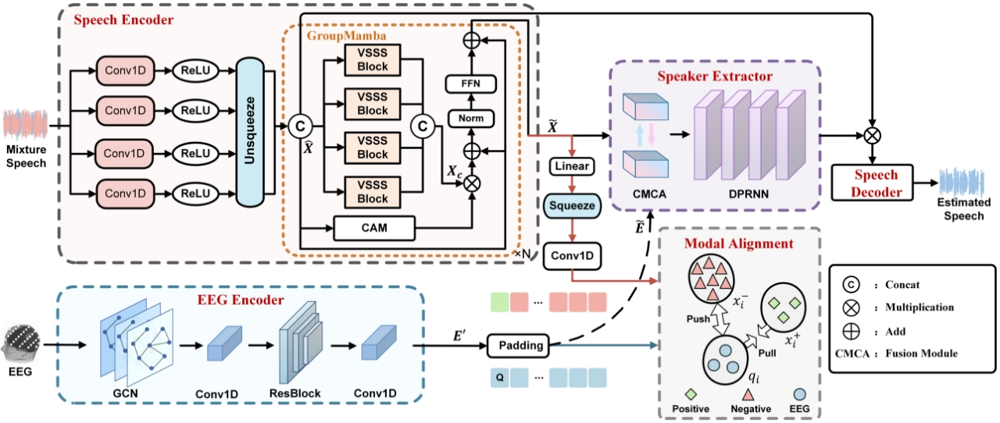

# M3ANet

Pytorch implementation on: M3ANet: Multi-scale and Multi-Modal Alignment Network for Brain-Assisted Target Speaker Extraction.

## Introduction

This paper proposes a multi-scale and multi-modal alignment Network (M3ANet) for brain-assisted TSE. Specifically, to eliminate the temporal inconsistency between EEG and speech modalities, the modal alignment module that uses a contrastive learning strategy is applied to align the temporal features of both modalities. Additionally, to fully extract speech information, multi-scale convolutions with GroupMamba modules are used as the speech encoder, which scans speech features at each scale from different directions, enabling the model to capture deepe sequence information. Experimental results on three publicly available datasets show that the proposed model outperforms current state-of-the-art methods across various evaluation metrics, highlighting the effectiveness of our proposed method.


## Requiements

- python 3.10
- torch  2.1.1+cu118
- mamba-ssm  1.2.0

## Datasets
- The source and processing of the Cocktail Party dataset can be obtained [here](https://github.com/jzhangU/Basen)
- AVED dataset can be obtained [here](https://www.sciopen.com/article/10.16511/j.cnki.qhdxxb.2024.26.024)
- MM-AAD dataset can be obtained [here](https://dl.acm.org/doi/10.1016/j.inffus.2025.102946)

## Run

You can change the config in ```config/M3ANET.json``` and in ```config/experiments.json```.

### Train

```python distributed.py -c configs/M3ANET.json```

### Test

```python test.py -c configs/experiments.json```
